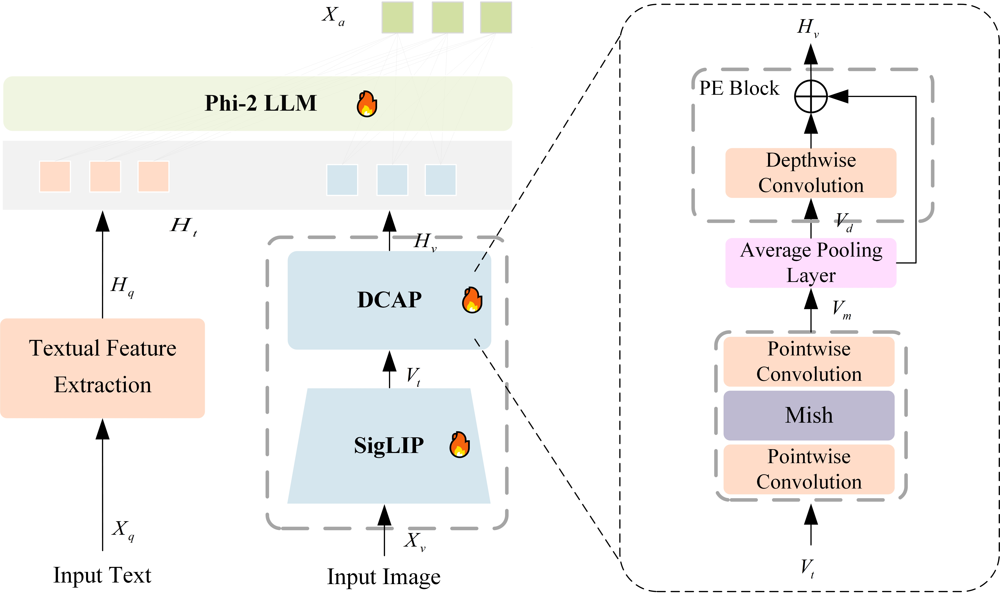

# LCMA-LLM


## Usage
### Requirements
we use 10 RTX3090 for training and evaluation. 
```
conda create -n lcma python=3.10 -y
conda activate lcma
pip install --upgrade pip  # enable PEP 660 support
pip install -e .
```
### Hyperparameters
The hyperparameters used in pretraining and finetuning are provided below.

1. Pretraining

| Hyperparameter | Global Batch Size | Learning rate | Epochs | Max length | Weight decay |
|----------------| ---: | ---: | ---: | ---: | ---: |
| LCMA         | 256 | 1e-3 | 1 | 2048 | 0 |

2. Finetuning

| Hyperparameter | Global Batch Size | Learning rate | Epochs | Max length | Weight decay |
|----------------| ---: | ---: |-------:| ---: | ---: |
| LCMA      | 128 | 2e-5 |      2 | 2048 | 0 |

## Download
[Phi-2](https://huggingface.co/susnato/phi-2) and
[SigLIP](https://huggingface.co/google/siglip-so400m-patch14-384)

## Training
Two stages: (1) feature alignment stage: use [LLaVA-1.5](https://github.com/haotian-liu/LLaVA/blob/main/docs/Data.md) 558K subset of the LAION-CC-SBU dataset to connect a *frozen pretrained* vision encoder to a *frozen LLM*; 
(2) visual instruction tuning stage: visual instruction tuning stage: use 150K GPT-generated multimodal instruction-following data, plus around 515K VQA data from academic-oriented tasks, to teach the model to follow multimodal instructions.

###  Pretraining
```
bash ./scripts/lcma/pretrain.sh
```
###  Finetuning
```
bash ./scripts/lcma/finetune.sh
```

##  Evaluation
See [Evaluation.md](https://github.com/haotian-liu/LLaVA/blob/main/docs/Evaluation.md).

##  Acknowledgments
Thanks for these wonderful work and [LLaVA-Phi](https://github.com/xmoanvaf/llava-phi)
